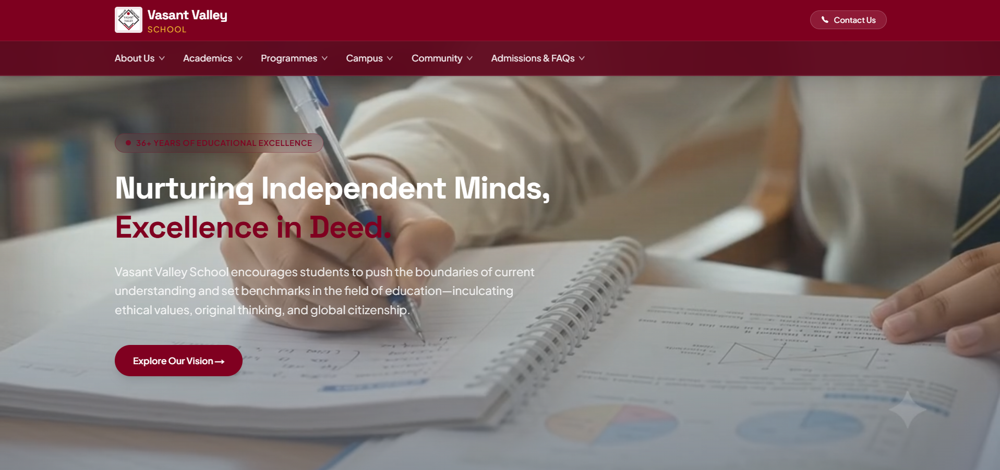
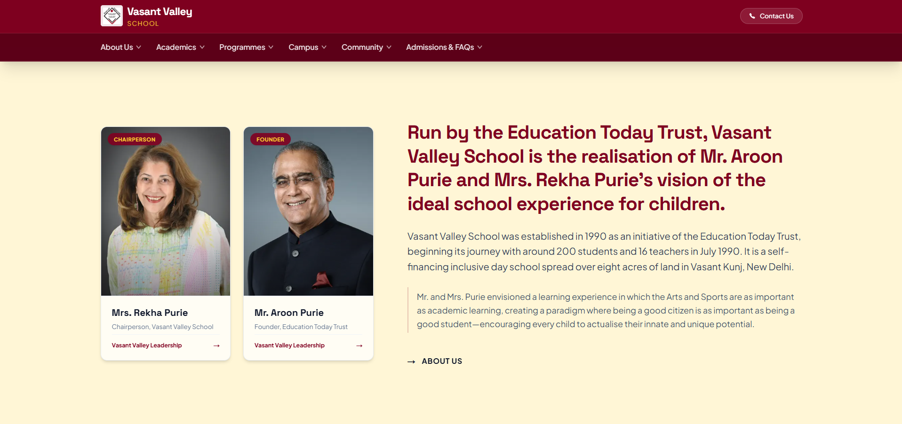
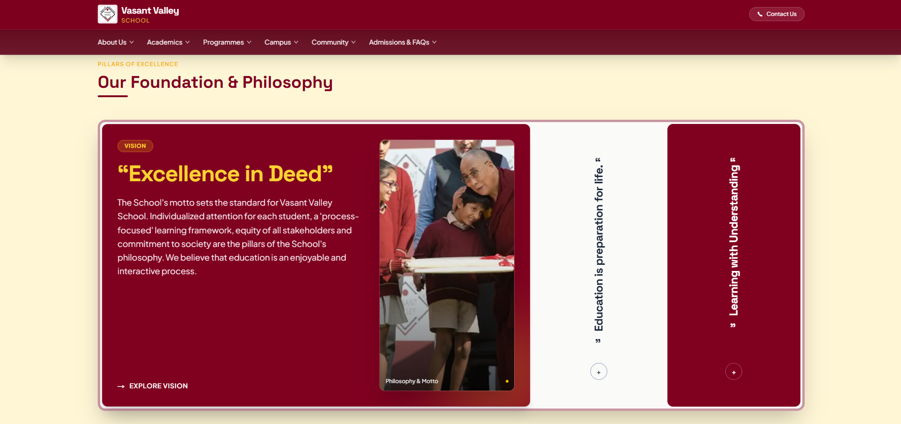
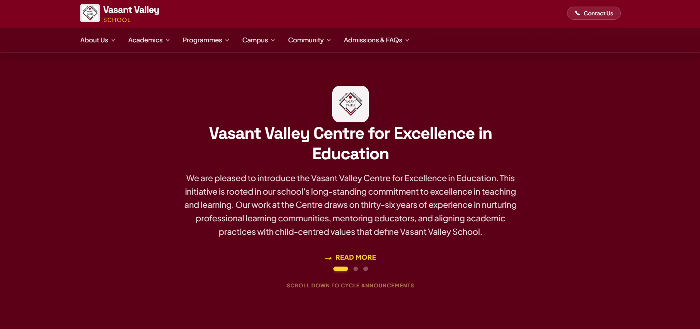
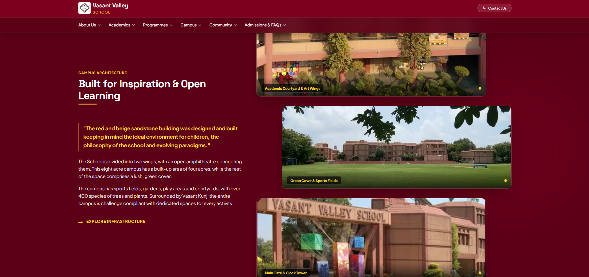
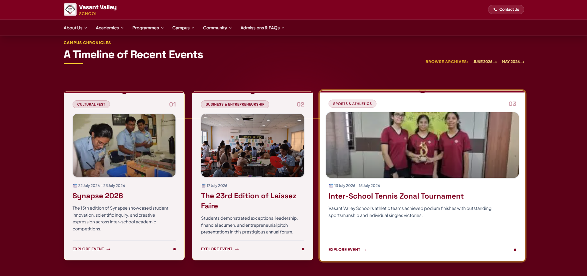
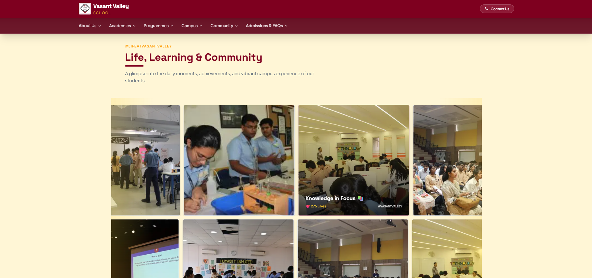
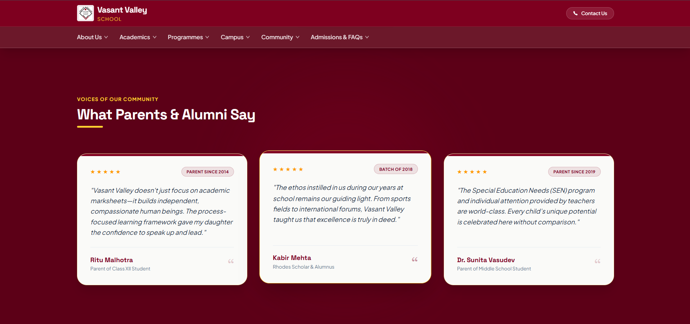
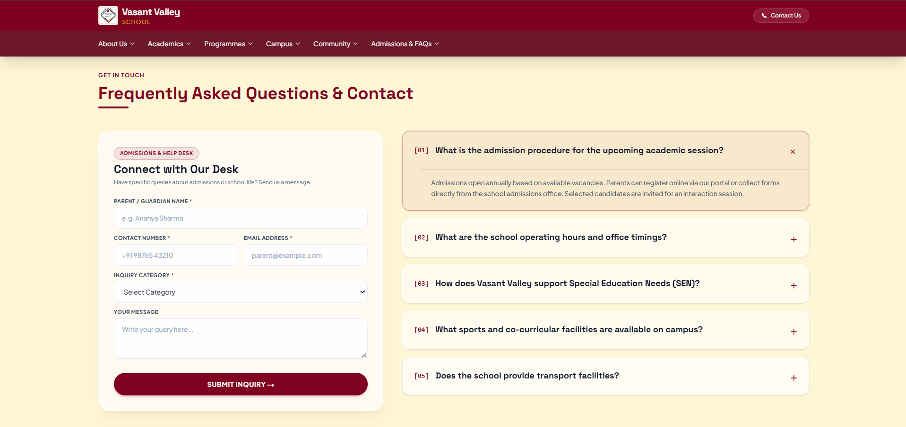
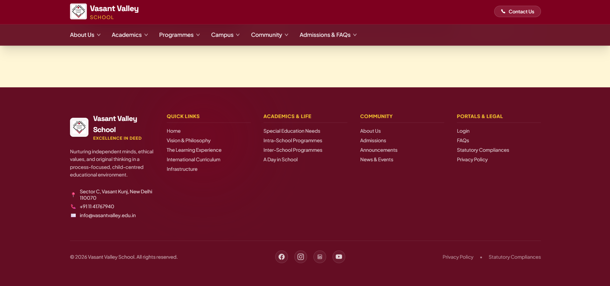

# 🏫 Vasant Valley School — Modern Web Portal Redesign

A modern, responsive, and performance-driven web application redesign for **Vasant Valley School**, built as part of the Web Development Internship Assessment. This project reimagines the institutional website into an elite K-12 digital portal while preserving the school’s core heritage, values, and brand identity.

---

## 📌 Project Overview

The objective of this project is to transform the classic Vasant Valley School website into an engaging, accessible, and modern web platform. Utilizing modern web tools like **Next.js 14**, **Tailwind CSS**, and **Framer Motion**, the redesign introduces a refined visual hierarchy, glassmorphic UI elements, smooth micro-interactions, and fully responsive layouts across all device viewports.

---

## 📄 Submission & Developer Details

- **Full Name:** Muskan Maurya
- **Intern ID:** DET-INT-2026-VV
- **Email Address:** muskanmaurya2712@gmail.com
- **GitHub Username:** muskanmaurya
- **Selected Website:** [https://www.vasantvalley.org/](https://vasantvalley.org)
- **Live Demo Link:** [https://dettroin-int-muskan-website.vercel.app](https://dettroin-int-muskan-website.vercel.app) 

---

## 🛠️ Technologies Used

- **Framework:** [Next.js 14](https://nextjs.org/) (React Framework with App Router)
- **Styling & Design System:** [Tailwind CSS](https://tailwindcss.com/)
- **Animation & Physics Engine:** [Framer Motion](https://www.framer.com/motion/)
- **Programming Language:** [TypeScript](https://www.typescriptlang.org/)
- **Inquiry Processing API:** [Web3Forms API](https://web3forms.com/)
- **Icons:** React Icons / Lucide-React 
- **Deployment & Hosting:** [Vercel](https://vercel.com)

---

## ✨ Key Improvements & Design Highlights

1. **Brand-Aligned Palette:** Replaced harsh tech dark modes with a warm, prestige palette centered around Vasant Valley's heritage Maroon (`#800020`), Deep Burgundy (`#5c0017`), Warm Gold (`#D4AF37`), and Off-White Canvas (`#FAFAF8`).
2. **Interactive Accordion Pillars:** A custom spring-physics flex accordion showcasing school values (*Excellence in Deed*, *Education is preparation for life*, and *Learning with Understanding*).
3. **Scroll-Driven Announcements:** A locked-stage scroll section that cycles smoothly through announcements upon scrolling down.
4. **Interactive Timeline:** A connected horizontal event timeline (*Synapse 2026*, *Laissez Faire*, *Zonal Sports*) with dynamic card expansion on hover that seamlessly converts to a vertical layout on mobile.
5. **Architectural Campus Display:** A 3-tier staggered zigzag gallery highlighting red and beige sandstone campus infrastructure.
6. **Infinite Social Marquee:** Smooth dual-row horizontal image streams illustrating vibrant student life and campus activities.
7. **Production-Ready Help Desk Form:** Integrated Web3Forms handling admissions and general inquiries with real-time submission feedback.

---

## 📸 Section Screenshots

### 1. Hero Section
*Full-viewport backdrop featuring the school motto, primary CTA button, and glassmorphic top navigation header.*


### 2. About Us & Leadership
*Institutional narrative introducing founders Mr. Aroon Purie and Mrs. Rekha Purie alongside executive portrait cards.*


### 3. Pillars of Excellence
*Interactive spring accordion showcasing Vasant Valley's foundational philosophy and student engagement.*


### 4. Interactive Scroll Announcements
*Pinned scroll stage displaying institutional updates and the Vasant Valley Centre for Excellence on deep maroon.*


### 5. Campus Architecture & Infrastructure
*Staggered 3-tier building showcase highlighting the sports fields, sandstone wings, and iconic main gate.*


### 6. Timeline of Recent Events
*Beaded event rail featuring Synapse 2026, Laissez Faire, and Zonal Tournaments with dynamic card expansion.*


### 7. Life & Community Marquee
*Infinite dual-row floating photo marquee illustrating daily campus activities, labs, and student achievements.*


### 8. Voices of Our Community (Reviews)
*High-contrast parent and alumni testimonial card grid with star ratings and relation badges.*


### 9. FAQ & Admissions Help Desk
*Light glassmorphic admissions inquiry form paired with an interactive zero-padded FAQ accordion.*


### 10. Footer & Legal Information
*Comprehensive 5-column glassmorphic footer featuring quick links, contact info, and legal policies.*


---

## 🚀 Local Development Setup

Follow these steps to run the project locally on your machine:

1. **Clone the repository:**
   ```bash
   git clone https://github.com/muskanmaurya/DETTROIN-INT-Muskan-Website
1. **Install dependencies:**
   ```bash
   npm install
1. **Set up Environment Variables:**
   ```bash
   NEXT_PUBLIC_WEB3FORMS_ACCESS_KEY=your_web3forms_access_key_here
1. **Run the development server:**
   ```bash
   npm run dev
1. **Open in Browser:**
   ```bash
   Navigate to http://localhost:3000 to view the application.
